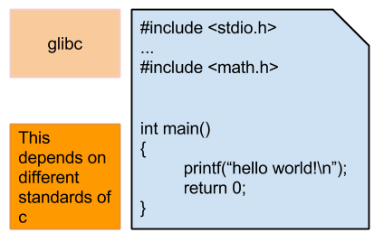

## glibc 套件版本與不同 C 標準之影響

### glibc 版本影響
如上圖所示，影響範圍在所引用之 C library。亦即，使用者若引用 C library 中的標頭檔，則須遵循標頭檔內的定義。版本不同，可能造成在 main 函式中呼叫特定函式或函式傳入參數之方法改變等問題。另外，較新版本也有可能是安全性更新，將漏洞修補，但不影響到撰寫程式時語法與library的功能。

### C standards 版本影響
如上圖所示，C standards 影響範圍主要在 main 函式本身與大括弧中所撰寫之 C 語言語法。例如：return type 是否需要寫？用 void main() 還是 int main()?等影響。

### 參考文獻
* [Implicit return type int c language](http://www.geeksforgeeks.org/implicit-return-type-int-c-language/)
* [C/C++ 中沒有 return 敘述的 main function](http://blog.crboy.net/2012/04/main-function-without-return-statement.html)
* [C11 standard](http://www.open-std.org/jtc1/sc22/wg14/www/docs/n1570.pdf)