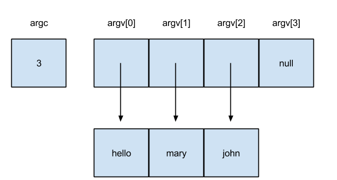

## wc_argv.md

```
#include <stdio.h>
#include <stdarg.h>

#define IN 1    /* inside a word */
#define OUT 0   /* outside a word */

/* count lines, words, and characters in input */
/* It is fundamental to c that char**x and char*x[]
   are two ways of expressing the same thing.*/

int main(int argc, char **argv)
{
    int c, nl, nw, nc, state;

    state = OUT;
    nl = nw = nc = 0;

    FILE *fp = fopen(argv[1], "r");

    if (!fp)
        printf("cannot open file %s", argv[0]);


    while ((c = getc (fp)) != EOF) {
        ++nc;
        if (c == '\n')
            ++nl;
        if (c == ' ' || c == '\n' || c == '\t')
            state = OUT;
        else if (state == OUT) {
            state = IN;
            ++nw;
        }
    }

    fclose (fp);
    printf("line:\t%d\nword:\t%d\nchar:\t%d\n", nl, nw, nc);
}
```

### 若 main function 有參數傳入

則須遵循以下規定 (英文部分，從手冊擷取)：

— The value of argc shall be nonnegative.

```
argc 之值不可為負數。
```

— argv[argc] shall be a null pointer.

```
argv[argc] 須為 null 指標。
```

— If the value of argc is greater than zero, the array members argv[0] through argv[argc-1] inclusive shall contain pointers to strings, which are given implementation-defined values by the host environment prior to program startup.

The intent is to supply to the program information determined prior to program startup from elsewhere in the hosted environment. If the host environment is not capable of supplying strings with letters in both uppercase and lowercase, the implementation shall ensure that the strings are received in lowercase.

```
若 argc 數值大於零，則 argv[0] 至 argv[argc-1] 陣列之值，
須為指向 strings 的指標。
這些值則是在 program startup 之前從 host environment 中取得的。

主要目的在於，支援程式獲取從系統環境中取得所需資訊。
若無法確定，host environment 是否同時支援傳入之字串字母大小寫，則字串一律用小寫。
```

— If the value of argc is greater than zero, the string pointed to by argv[0] represents the program name; argv[0][0] shall be the null character if the program name is not available from the host environment. If the value of argc is greater than one, the strings pointed to by argv[1] through argv[argc-1] represent the program parameters.

```
若 argc 數值大於零，則 argv[0] 指向的就是 program name 的字串。
若無法從 host environment 取得 program name，
則 argv[0][0] 之值為 null。

若 argc 數值大於一，則 argv[1] 至 argv[argc-1] 陣列
所指向的就是 program parameters。

例如：
有一程式名為 hello，執行該程式時可傳入兩參數。
則可在 CLI 介面輸入

$ hello mary john

而此時，程式內 argc 之值為 3 (hello + mary + john 三個 string)
而 argv[] 則如下圖所示：
```



— The parameters argc and argv and the strings pointed to by the argv array shall be modifiable by the program, and retain their last-stored values between program startup and program termination.

```
參數 argc、argv 以及 argv 陣列所指向的 string，皆可以被 program 修改。
且在 program startup 及 program termination 之間，
它們的 last-stroed values 皆可被保存。
```

### 參考文獻
* [C11標準文件](http://www.open-std.org/jtc1/sc22/wg14/www/docs/n1570.pdf)

